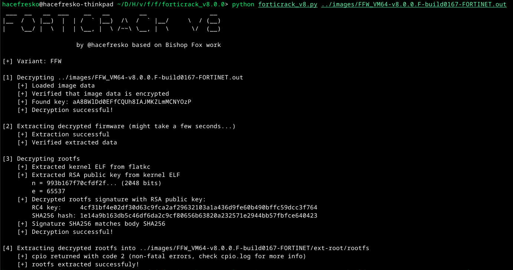
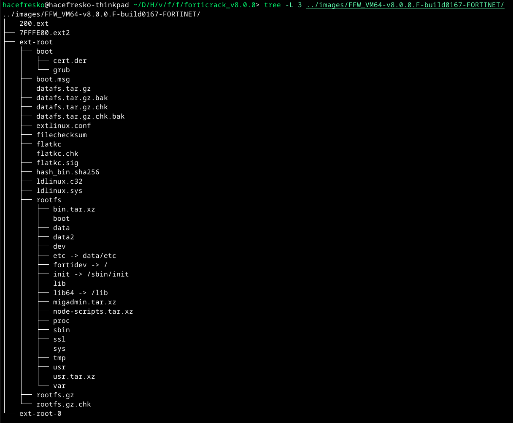

# Forticrack v8.0.0

Decrypt and extract FortiOS 8.0.0 firmware images. 

This script extends [Bishop Fox's Forticrack](https://github.com/BishopFox/forticrack) to support 8.0.0 firmware images. Also, [RandoriSec's article](https://blog.randorisec.fr/fortigate-rootfs-decryption/) on FortiGate 7.4.7 firmware encryption was really helpful to reverse the encryption for FortiOS 8.0.0, since it looks like a newer iteration of the 7.4.7 one. 

Works for both FGT and FFW images.

## Usage

>This was tested on both FGT and FFW v8.0.0.F-build0167. Other builds might require reversing the kernel again to find the exact kernel segments and virtual addresses of the RSA public key and the XOR key. 

The script tries to autodetect if the `.out` file is corresponds to FGT or FFW based on the naming. It can also be specified as an optional argument just in case.

```
$ python3 forticrack_v8.py
[x] Usage: python3 forticrack_v8.py <.out file> [FGT|FFW]
```

Demo:



Resulting directory:



## Why

There are already numerous articles and scripts on fortiOS decryption out there (like those mentioned previously). However, none of them apply to FortiOS 8.0.0, since Fortinet has modified its encryption once more.

## How this works

Fortinet allows downloading upgrade images both for FortiFirewall and FortiGate at `https://support.fortinet.com/ > Login > Support > VM Images`. These images are `.out` files, which is what this script expects as an input. When executed, it performs 4 major operations:

### 1. Decrypt the `.out` file (Bishop Fox's work)

The `.out` upgrade file is encrypted with a custom XOR-based block cipher. Bishop Fox reverse engineered it and published [forticrack](https://github.com/BishopFox/forticrack) along with [a great writeup](https://bishopfox.com/blog/breaking-fortinet-firmware-encryption). This part of the script uses practically the same code from the original forticrack from Bishop Fox, which extracts the corresponding 32-byte key and decrypts the `.out` file. I suggest you read the writeup if you want to know more about it.

### 2. Extract the decrypted image

The decrypted file is a standard Fortinet firmware image. The script extracts it using `binwalk`, producing the following file system:

```
ext-root
├── boot
│   ├── cert.der
│   └── grub
│       ├── BOOTX64.EFI
│       ├── grub.cfg
│       └── grubx64.efi
├── boot.msg
├── datafs.tar.gz
├── datafs.tar.gz.bak
├── datafs.tar.gz.chk
├── datafs.tar.gz.chk.bak
├── extlinux.conf
├── filechecksum
├── flatkc
├── flatkc.chk
├── flatkc.sig
├── hash_bin.sha256
├── ldlinux.c32
├── ldlinux.sys
├── rootfs.gz
└── rootfs.gz.chk
```

Where:

- `boot/`         : Directory with bootloader files
- `datafs.tar.gz` : Data filesystem
- `flatkc`        : Linux kernel `bzImage`
- `rootfs.gz`     : Encrypted filesystem

All interesting files for vulnerability researchers, such as `/bin/init`, are encrypted inside `rootfs.gz`.

### 3. Decrypt `rootfs.gz` (the novel part)

This is the part that is new for version 8.0.0. To figure it out, Claude Code was heavily used to reverse the corresponding decryption logic and get the hardcoded virtual addresses inside the kernel image, taking [RandoriSec's article on FortiGate 7.4.7](https://blog.randorisec.fr/fortigate-rootfs-decryption/) as a reference. From my experience, AI assisted reversing really shines when analyzing cryptography stuff, which was a classic hardcore task when manual reversing was the only option.

File `rootfs.gz` is encrypted with a custom stream cipher called FORT-RC4. The key to decrypt it is embedded inside a PKCS#1 RSA signature appended at the end of the file. In order to decrypt this signature, the corresponding RSA public key must be used, which can be recovered from the kernel image.

Since `flatkc` is a `bzImage`, the kernel ELF can be easily extracted by locating the gzip payload inside and decompressing it. Inside the ELF, at virtual address `0xffffffff8179a1a0`, there are 270 bytes of XOR-encoded DER data representing the RSA public key. The 32-byte XOR key to decode it lives at `0xffffffff8179a2c0`. Decoding is just `decoded[i] = encoded[i] ^ xor_key[i & 0x1f]`, and the result parses as a standard PKCS#1 RSAPublicKey DER structure (an RSA-2048 public key).

With the RSA public key recovered, the signature block (last 256 bytes of `rootfs.gz`) is decrypted by computing `m = sig^e mod n`. The 256-byte result is a PKCS#1 v1.5 Type 1 padded message with the following layout:

```
m[0x00]       = 0x00
m[0x01]       = 0x01
m[0x02..0x9E] = 0xFF (157 padding bytes)
m[0x9F]       = 0x00
m[0xA0..0xBF] = SHA256(rootfs.gz[:-256])
m[0xC0..0xDF] = (unused)
m[0xE0..0xFF] = RC4 key (32 bytes)
```

The SHA-256 hash is verified against the body of `rootfs.gz` as a sanity check, and the 32-byte RC4 key at the end is what is actually used to decrypt the file.

Regarding FORT-RC4, it was completely *vibe-reversed* by Claude. Here is how it works:

>FORT-RC4 has a standard KSA but a modified PRGA: instead of producing one keystream byte per round from a single S-box lookup, it does two extra lookups using bit-mixed versions of `i` and `j`, XORs `0xAA` into a mix index, and combines two S-box values to produce the final byte. There is also a difference between FGT and FFW: in FGT, both `i` and `j` are reset to 0 after the KSA before PRGA starts, while in FFW `j` carries over from the KSA. This is visible in the FGT kernel at offset `+0x83` inside the cipher function as the byte sequence `31 c0 31 d2` (`xor eax,eax; xor edx,edx`), which is absent in FFW. This is why the script needs to know the variant.

#### How this differs from RandoriSec's 7.4.7 approach

As mentioned, [RandoriSec's article on 7.4.7](https://blog.randorisec.fr/fortigate-rootfs-decryption/) was a useful reference, but the encryption mechanism changed enough that their approach didn't directly apply to 8.0.0, so these are the main differences:

- In 7.4.7, the RSA key is obfuscated with ChaCha20 using a seed from the `.init.data` kernel section. In 8.0.0, that section is all zeros, so a plain XOR scheme is used instead.
- In 7.4.7, the `rootfs` is encrypted with AES-CTR. In 8.0.0, it's FORT-RC4 (a custom encryption algorithm).
- In 7.4.7, the kernel has symbols, so the RSA key can be located by following cross-references to `rsa_parse_pub_key`. The 8.0.0 kernel is stripped, so the virtual addresses had to be found by reversing the decryption routine directly.

The virtual addresses for the RSA key blob are close between versions (shifted by `0x3000`), which also helped during reversing.

### 4. Extract the filesystem

The decrypted output is a real `gzip` file. By decompressing it, a CPIO archive is obtained, which is the standard Linux `initrd` format and can be easily extracted with `cpio -idmv`.
